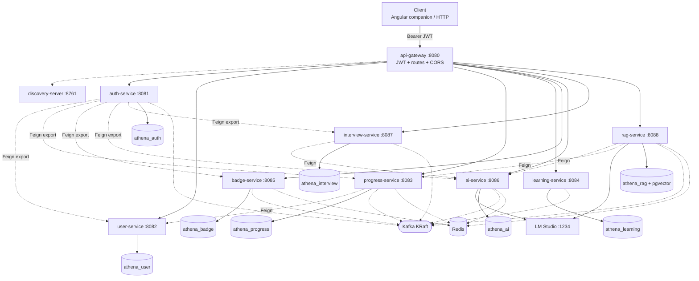
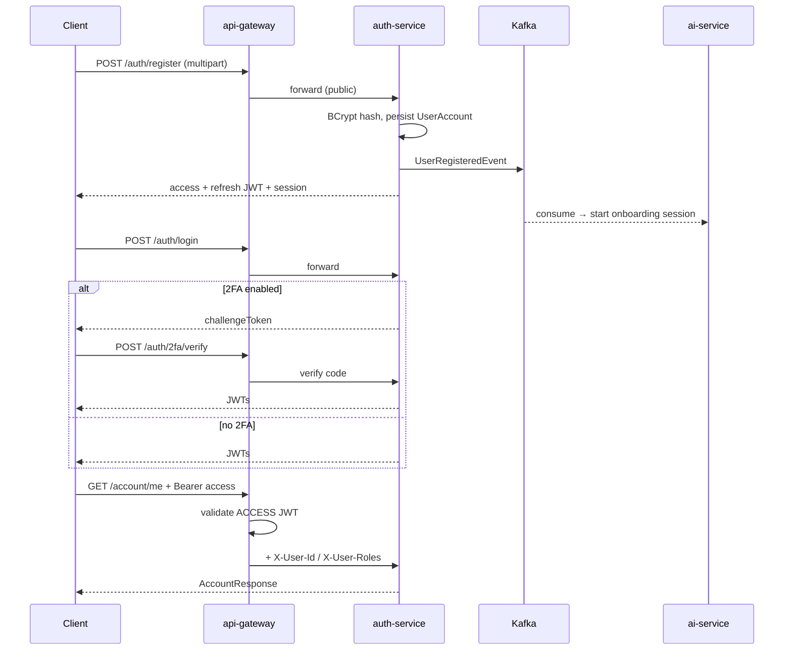
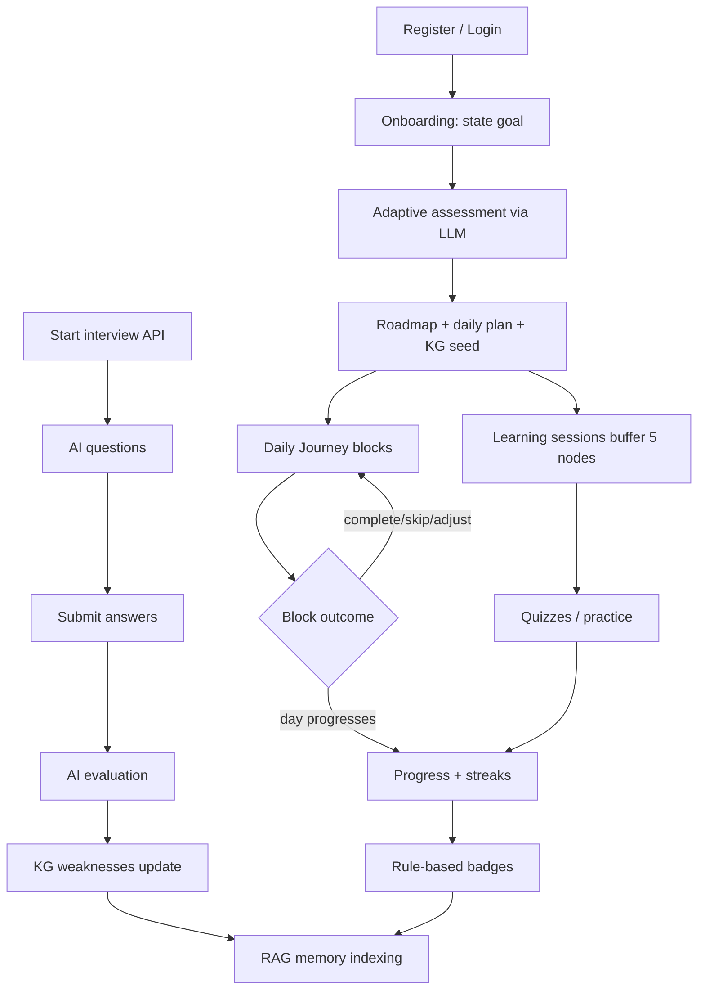

# Athena — Complete Technical Documentation

> **Source of truth scope:** This document was reverse-engineered from the `Athena-Backend-Parent` repository (backend platform, Docker stack, Maven modules, foundation Playwright harness, and in-repo docs).  
> **Companion frontend:** Angular application sources live in a **separate** repository ([`Tamara556/Athena-Frontend`](https://github.com/Tamara556/Athena-Frontend)). Frontend sections below are based on companion documentation present in *this* repo (`docs/Frontend.md`, `FUNCTIONAL_SPECIFICATION_FRONTEND.md`) and are labeled accordingly.  
> **Rule used throughout:** Features are marked **IMPLEMENTED** only when verified in source/config. Spec/docs-only claims that lack matching Java controllers are called out as **Not verified in the current repository.**

---

## 1. Project Overview

### What Athena is

**Athena** is an AI-powered **Learning Operating System**. Instead of offering a static catalogue of courses, it builds a personalized, continuously adapting curriculum around an individual learner: an AI-generated roadmap, a daily adaptive “mission,” weekly skill interviews, a knowledge graph of mastery, and a retrieval-augmented memory layer the learner can query about their own progress.

This repository (`athena-backend-parent`, Maven artifact `com.athena:athena-backend-parent:1.0.0`) is the **backend platform**: Spring Boot microservices, database-per-service PostgreSQL, Kafka event choreography, Redis caching, Eureka discovery, an API gateway with centralized JWT auth, and local LLM inference via [LM Studio](https://lmstudio.ai) (OpenAI-compatible API). The web UI is not packaged here.

### Problem it solves

Traditional LMS platforms assume a fixed curriculum and measure progress mainly as “lessons completed.” Athena targets learners who want to learn *anything* (domain-agnostic goals), need a path generated and adapted for them, and benefit from continuous assessment (interviews, quizzes, knowledge-graph mastery) rather than passive content consumption.

### Core product philosophy

1. **One learner, one living curriculum** — roadmap and daily plans are generated and adjusted, not merely selected from a catalogue.
2. **AI reasoning is centralized and swappable** — LLM calls go through `athena-llm` / `ai-service` (and embeddings through `rag-service`), with structured JSON outputs and graceful degradation on outages.
3. **Services stay independently deployable** — no shared database; side effects use Kafka choreography; the gateway is the only public entry for clients.
4. **Honest architecture** — design docs in `docs/` explicitly document strengths and weaknesses; the ROADMAP avoids inventing features.

### Who the system is designed for

- **Learners** using the companion Angular app (or any client of the gateway API).
- **Engineers** studying or extending a realistic event-driven Spring Boot microservices system with a local-LLM AI layer.

### How Athena differs from a traditional LMS

| Traditional LMS | Athena (product intent + implemented backend) |
|---|---|
| Fixed course catalogue | AI-generated personalized roadmap from a stated goal |
| Linear lesson unlock | Adaptive Daily Journey that reprioritizes mid-day |
| Quizzes as chapter tests | Weekly AI interviews + knowledge-graph mastery updates |
| Progress = % complete | Progress, streaks, badges, KG visualization, RAG memory |
| Often shared monolith DB | Database-per-service + Kafka choreography |

### Main learning lifecycle (implemented backend path)

```
Register → (Kafka) auto-start onboarding → Submit goal → Adaptive assessment
    → Roadmap + daily plan + KG seed → Learning sessions (5-node lookahead)
    → Daily Journey blocks → Progress/streaks → Badges
    → Interviews (on-demand API; weekly scheduler partially wired)
    → Interview evaluation → KG update → RAG indexing of learning artifacts
```

### Implemented vs vision (high level)

| Area | Status |
|---|---|
| Microservices platform (gateway, Eureka, Kafka, Redis, DB-per-service) | **IMPLEMENTED** |
| Auth, account, 2FA, devices, export, avatars | **IMPLEMENTED** |
| AI onboarding, roadmap, daily plan, Daily Journey, learning sessions, KG | **IMPLEMENTED** (requires LM Studio) |
| Interview APIs + AI question/evaluation | **IMPLEMENTED**; weekly roster wiring incomplete |
| RAG memory (pgvector) | **IMPLEMENTED** |
| Progress, streaks, rule-based + AI-suggested badges | **IMPLEMENTED** (`FIRST_PLAN_COMPLETED` seeded but not auto-awarded) |
| Angular frontend | **Separate repo** (not in this repository) |
| OpenAPI/Swagger, K8s/IaC, gateway rate limiting, Vault | **PLANNED / recommended** (see §26) |
| `GET /ai/insights/me` | Mentioned in functional specs; **Not verified in the current repository** (no Java controller found) |

---

# PART I — TECHNOLOGY STACK

## 2. Complete Technology Stack

### Backend

| Technology | Version (verified) | Purpose | Where used | Interactions |
|---|---|---|---|---|
| **Java** | **26** (`java.version` / `maven.compiler.release` in root `pom.xml`) | Language runtime | All modules | Compiled by Maven; Docker images `eclipse-temurin:26-jdk` / `26-jre` |
| **Spring Boot** | **4.0.5** (parent POM) | Application framework | All runnable services + libraries | Provides starters, autoconfig, Actuator |
| **Spring Cloud** | **2025.1.1** (Oakwood BOM) | Gateway, Eureka, OpenFeign | gateway, discovery, Feign clients | Service discovery + load-balanced routing |
| **Spring Cloud Gateway** | via Cloud BOM (`spring-cloud-starter-gateway-server-webflux`) | Edge routing + JWT filter | `api-gateway` | Routes to Eureka services; WebFlux |
| **Netflix Eureka** | via Cloud BOM | Service registry | `discovery-server` + all clients | Clients register; gateway uses `lb://` |
| **OpenFeign** | via Cloud BOM | Synchronous HTTP between services | auth, progress, interview, rag | Used only for request/response fan-out, not side effects |
| **Spring WebMVC** | Boot BOM | REST APIs | All business services | Controllers → services → repos |
| **Spring WebFlux** | Boot BOM | Reactive HTTP client / gateway | gateway; ai-service & rag-service (LLM HTTP) | LM Studio OpenAI-compatible calls |
| **Spring Data JPA / Hibernate** | Boot BOM | ORM | All DB-backed services | Entities ↔ PostgreSQL |
| **PostgreSQL** | **17** (`postgres:17-alpine` in Compose); rag uses **pgvector/pgvector:pg17** | Primary datastore | One DB per business service | Liquibase migrations at startup |
| **Liquibase** | Boot-managed (`spring-boot-liquibase`) | Schema migrations | auth, user, progress, learning, badge, ai, interview, rag | Changelog YAML under each service |
| **Apache Kafka** | **3.9.1** (`apache/kafka:3.9.1`, KRaft) | Async event choreography | Most business services | Topics defined in `athena-common` |
| **Redis** | **7** (`redis:7-alpine`) | Spring Cache | progress, badge, ai (+ rag has Redis client config) | Cache TTLs per service `CacheConfig` |
| **JJWT** | **0.12.6** | JWT create/validate | `athena-common` `JwtService`; used by auth + gateway | HS256; access + refresh types |
| **Spring Security Crypto** | Boot BOM | BCrypt password hashing | `auth-service` only | No full Spring Security filter chain in business services |
| **AWS SDK v2** | **2.31.0** | S3 avatars + CloudWatch Logs | `athena-common` auto-config | LocalStack-compatible endpoints |
| **Lombok** | Boot-managed | Boilerplate reduction | Most modules | Annotation processing |
| **Micrometer Tracing (Brave)** | Boot-managed | Distributed tracing bridge | progress, learning, badge, ai, interview, rag | Observability |
| **Maven + Wrapper** | Multi-module reactor | Build | Root `pom.xml`, `mvnw` / `mvnw.cmd` | CI runs `./mvnw clean verify` |
| **JaCoCo** | **0.8.15** | Coverage | Parent + `coverage-report` aggregator | Aggregate HTML under `coverage-report/target/...` |
| **Testcontainers** | **1.20.5** (pinned property) | Integration tests | `*IT` tests | Real Postgres/pgvector/Kafka in CI |
| **JUnit 5 / Mockito / AssertJ** | Boot test BOM | Unit & slice tests | `*Test` classes | Surefire |
| **Docker / Compose** | Compose file `name: athena` | Local full stack | Root `docker-compose.yml` + 10 Dockerfiles | Builds all runnable services |

**Not present (verified absent):** Flyway, Spring Cloud Config Server, Spring Security OAuth2 resource-server filter chains in business services, WireMock as a vendored dependency, Angular app sources in this repo.

---

### Frontend

> **Important:** There is **no** `angular.json` and no application `package.json` outside `foundation-tests/` in this repository. The following is documented from companion docs checked into this repo and describes the **separate** Athena-Frontend project.

| Technology | Version | Purpose | Evidence in this repo |
|---|---|---|---|
| **Angular** | **20** | SPA | `README.md`, `docs/Frontend.md`, `FUNCTIONAL_SPECIFICATION_FRONTEND.md` |
| **TypeScript** | Companion app; Playwright harness uses **^5.6.0** | Language | `foundation-tests/package.json` |
| **Standalone components** | Angular 20 style | Routing/features | Functional spec §0 |
| **Signals** | Angular Signals | Client state (no NgRx) | Functional spec §0; `docs/Frontend.md` |
| **Angular Router** | Lazy-loaded routes | Navigation + guards | Functional spec §0.4 |
| **HttpClient + interceptor** | `authInterceptor` | Bearer token + 401 → login | Functional spec §0.2 |
| **Custom CSS design system** | — | UI | Spec states **no Material / no Tailwind** |
| **Playwright** | **^1.50.0** | E2E/smoke against frontend + gateway | `foundation-tests/` |

---

### AI

#### Implemented AI functionality

| Piece | Status | Details |
|---|---|---|
| **Local LLM via LM Studio** | **IMPLEMENTED** | OpenAI-compatible HTTP at `http://localhost:1234/v1` (default) |
| **`athena-llm` abstraction** | **IMPLEMENTED** | `ChatProvider`, `EmbeddingProvider`, `LmStudioChatProvider`, structured output parser, Spring auto-config |
| **Chat model default** | **IMPLEMENTED** | `qwen3-14b` (`athena.llm.chat.model` / `ATHENA_AI_MODEL`) |
| **Embedding model default** | **IMPLEMENTED** | `text-embedding-bge-m3`, dimension **1024** |
| **Structured JSON generation** | **IMPLEMENTED** | Schema-enforced completions in `ai-service` (`LlmService` / generation pipeline) |
| **Onboarding / roadmap / daily plan / sessions / Daily Journey / interview AI / badge suggestions** | **IMPLEMENTED** | Controllers & services in `ai-service` |
| **RAG (chunk → embed → pgvector → grounded Q&A)** | **IMPLEMENTED** | `rag-service` |
| **AI outage retry lifecycle** | **IMPLEMENTED** | `RetryController` `/ai/retry/{requestId}` + persisted retry state |

#### Planned / incomplete AI-related items

| Item | Status |
|---|---|
| Weekly interview **roster** auto-start | Scheduler exists; roster wiring incomplete (`ROADMAP.md`) |
| `GET /ai/insights/me` InsightsProfile API | Described in functional specs; **Not verified in Java sources** |
| Splitting `ai-service` by DDD bounded contexts | Design recommendation only |
| External paid cloud LLM providers as first-class production backends | Not implemented; abstraction could allow it, but only LM Studio SPI is present |

AI is **not mocked as a stub service** in production code — it calls a real local OpenAI-compatible endpoint. Tests mock `ChatProvider` / `EmbeddingProvider`.

---

### Infrastructure

| Component | Verified detail |
|---|---|
| Docker | 10 Dockerfiles (multi-stage Temurin 26) |
| Docker Compose | Full local stack: discovery, Kafka, Redis, 8× Postgres (+ pgvector), 10 apps |
| Networking | Default Compose network; host ports published; `host.docker.internal` for LM Studio / LocalStack |
| Databases | DB-per-service; volumes `*-db-data` |
| Service discovery | Eureka `:8761` |
| API gateway | `:8080` |
| Kafka | KRaft single-node; host `29092`, internal `9092` |
| Redis | `:6379` |
| External (optional) | LM Studio `:1234`; LocalStack `:4566` for S3/CloudWatch (not in Compose) |
| Env config | Per-service `application.yml` + env overrides; root `.env.example` (CloudWatch toggle) |
| CI | GitHub Actions `ci.yml` (build/test; no image publish per ROADMAP) |

---

# PART II — BACKEND

## 3. Backend Architecture

### Style

Athena backend is a **microservices** system:

- **2 shared libraries:** `athena-common`, `athena-llm`
- **1 discovery server:** Eureka
- **1 API gateway:** Spring Cloud Gateway (WebFlux) + JWT filter
- **8 business services:** auth, user, progress, learning, badge, ai, interview, rag
- **1 coverage aggregator:** `coverage-report` (JaCoCo only)

### Service responsibilities (summary)

| Service | Port | Responsibility |
|---|---|---|
| discovery-server | 8761 | Eureka registry |
| api-gateway | 8080 | Routing, CORS, JWT validation, identity headers |
| auth-service | 8081 | Accounts, JWT issue, 2FA, devices, export, avatars |
| user-service | 8082 | Profiles + settings |
| progress-service | 8083 | Progress metrics + streaks |
| learning-service | 8084 | Plans, tasks, learning sessions (engine) |
| badge-service | 8085 | Badge catalogue + awards |
| ai-service | 8086 | LLM orchestration: onboarding → Daily Journey → KG → session content → interview AI helpers |
| interview-service | 8087 | Interview lifecycle; Feign to ai-service for generate/evaluate |
| rag-service | 8088 | Memory documents, embeddings, RAG Q&A, recommendations |

### Communication patterns

- **Synchronous (client → platform):** Browser/client → **api-gateway** → business service (load-balanced via Eureka).
- **Synchronous (service → service):** OpenFeign for read/fan-out that must finish before the HTTP response (export, interview AI, RAG enrichment, progress→user lookup).
- **Asynchronous:** Kafka topics for side effects (registration→onboarding, task→progress→badges, interview→KG, etc.).
- **Auth model:** Only the gateway validates JWTs. Downstream services trust `X-User-Id` / `X-User-Roles` (gateway strips client-supplied copies).

### Textual architecture diagram (actual)

```
Client (Angular / curl / Postman)
        │  Bearer JWT
        ▼
api-gateway :8080  ──registers/discovers──► discovery-server :8761
        │
        ├── /auth/**, /account/** ──────────► auth-service :8081 ──► athena_auth (Postgres :5433)
        ├── /users/** ──────────────────────► user-service :8082 ──► athena_user (:5434)
        ├── /progress/** ───────────────────► progress-service :8083 ──► athena_progress (:5435) + Redis
        ├── /plans/**, /tasks/**, /sessions/** ► learning-service :8084 ──► athena_learning (:5436)
        ├── /badges/**, /users/*/badges ────► badge-service :8085 ──► athena_badge (:5437) + Redis
        ├── /ai/**, /learning-sessions/**, /daily-journey/** ► ai-service :8086 ──► athena_ai (:5438) + Redis
        │                                         └── HTTP ──► LM Studio :1234
        ├── /interviews/** ─────────────────► interview-service :8087 ──► athena_interview (:5439)
        └── /rag/**, /ai/memory/** ─────────► rag-service :8088 ──► athena_rag+pgvector (:5440) + Redis
                                              └── HTTP ──► LM Studio (chat + embeddings)

Kafka (events across auth, learning, progress, badge, ai, interview, rag)
```

---

## 4. Backend Module / Microservice Breakdown

### 4.1 `athena-common` (library)

**Purpose:** Shared cross-cutting library (not a runnable service).

**Responsibilities:** JWT helpers (`JwtService`, `TokenType`, `AuthHeaders`); Kafka topic constants + event record types; `ApiError` / domain exceptions / global exception handler helpers; S3 image storage auto-config; CloudWatch logging auto-config.

**Technologies:** JJWT 0.12.6, AWS SDK CloudWatch Logs + S3 2.31.0, Jakarta Validation, Spring Web (provided), Lombok.

**Database / Controllers / Redis:** None.

**Important logic:** Single place for token crypto and event schema so producers/consumers do not hand-roll topic strings or JWT claim shapes.

---

### 4.2 `athena-llm` (library)

**Purpose:** Provider abstraction for chat + embeddings.

**Responsibilities:** `ChatProvider` / `EmbeddingProvider` SPI; LM Studio OpenAI-compatible implementations; structured output parsing; Spring Boot auto-configuration (`LlmAutoConfiguration`).

**Technologies:** Spring WebFlux / Reactor Netty, Spring Boot autoconfigure (provided), validation API, Lombok.

**Config prefix:** `athena.llm.chat.*`, `athena.llm.embedding.*` (defaults point at `http://localhost:1234/v1`).

**Used by:** `ai-service`, `rag-service`.

---

### 4.3 `discovery-server`

**Purpose:** Netflix Eureka service registry.

**Main class:** `com.athena.discovery.DiscoveryServerApplication` (`@EnableEurekaServer`).

**Port:** `8761`.

**Responsibilities:** Accept service registrations; provide registry for gateway `lb://` URIs.

**Config notes:** Does not register itself (`register-with-eureka: false`, `fetch-registry: false`); self-preservation disabled for local predictability.

**Database / Kafka / Redis / Security filters:** None.

---

### 4.4 `api-gateway`

**Purpose:** Single public HTTP entry; JWT validation; CORS; route table.

**Main class:** `com.athena.gateway.ApiGatewayApplication`.

**Port:** `8080`.

**Technologies:** Spring Cloud Gateway WebFlux, Eureka client, Actuator, `athena-common`.

**Security:** `JwtAuthenticationFilter` (WebFilter). Public: `/auth/**`, `/actuator/**`, OPTIONS. Others require Bearer **access** token. Injects `X-User-Id`, `X-User-Roles`.

**CORS:** Origin from `athena.frontend.origin` (default `http://localhost:4200`), credentials enabled.

**Routes (from `application.yml`):**

| Route id | Path | Target |
|---|---|---|
| auth-service | `/auth/**` | `lb://auth-service` |
| account-service | `/account/**` | `lb://auth-service` |
| user-plans | `/users/*/plans` | `lb://learning-service` |
| user-badges | `/users/*/badges` | `lb://badge-service` |
| user-service | `/users/**` | `lb://user-service` |
| progress-service | `/progress/**` | `lb://progress-service` |
| learning-plans | `/plans/**` | `lb://learning-service` |
| learning-tasks | `/tasks/**` | `lb://learning-service` |
| learning-sessions | `/sessions/**` | `lb://learning-service` |
| badge-service | `/badges/**` | `lb://badge-service` |
| rag-memory | `/ai/memory/**` | `lb://rag-service` |
| rag-service | `/rag/**` | `lb://rag-service` |
| ai-service | `/ai/**` | `lb://ai-service` |
| learning-sessions *(duplicate id in YAML)* | `/learning-sessions/**` | `lb://ai-service` |
| daily-journey | `/daily-journey/**` | `lb://ai-service` |
| interview-service | `/interviews/**` | `lb://interview-service` |

**Database / Kafka / Redis:** None.

---

### 4.5 `auth-service`

**Purpose:** Authentication, session devices, account management, JWT issuance.

**Port:** `8081` · **DB:** `athena_auth` (host port `5433`).

**Technologies:** WebMVC, JPA, Validation, Actuator, Eureka, OpenFeign, Kafka, Liquibase, PostgreSQL, `spring-security-crypto` (BCrypt), `athena-common`.

**Controllers:** `AuthController` (`/auth`), `AccountController` (`/account`).

**Entities:** `UserAccount`, `DeviceSession`, `LoginEvent`, `TwoFactorChallenge` (+ element collection `user_account_roles`).

**Repositories:** Matching Spring Data repos for the above.

**Services:** `AuthService`/`AuthServiceImpl`, `AccountService`/`AccountServiceImpl`, `DeviceService`, `DataExportService`, `UserImageService`, `VerificationCodeService`.

**Feign (export aggregation):** user settings, progress, badges, AI roadmaps/daily plans, interviews.

**Events:** Produces `athena.user.registered` (`UserRegisteredEvent`).

**Security:** Password BCrypt; JWT access **15m** / refresh **30d** (defaults); SMS 2FA provider pluggable (`log` default, Twilio via env); no Spring Security filter chain — gateway protects `/account/**`.

**Liquibase:** `001`–`007` (accounts, identity fields, image, login activity, 2FA, devices, SMS 2FA).

---

### 4.6 `user-service`

**Purpose:** Learner profiles and settings.

**Port:** `8082` · **DB:** `athena_user` (`5434`).

**Controllers:** `UserController` (`/users`), `UserSettingsController` (`/users/me/settings`).

**Entities:** `UserProfile`, `UserSettings`.

**Services:** `UserProfileService`, `UserSettingsService` (+ impls).

**Kafka / Redis / Feign:** None.

**Liquibase:** `001-create-user-profile`, `002-create-user-settings`.

---

### 4.7 `progress-service`

**Purpose:** Learning progress counters and daily streaks.

**Port:** `8083` · **DB:** `athena_progress` (`5435`).

**Controller:** `ProgressController` (`/progress`).

**Entities:** `LearningProgress`, `DailyProgress`.

**Service:** `ProgressServiceImpl` with `@Cacheable("progress")`.

**Feign:** `UserClient` → `GET /users/{id}`.

**Kafka:** Consumes `athena.task.completed`, `athena.interview.evaluated`; produces `athena.streak.updated`.

**Redis:** Spring Cache, TTL **10 minutes**, cache name `progress`.

**Liquibase:** `001-create-progress`, `002-add-daily-interviews`.

---

### 4.8 `learning-service`

**Purpose:** Learning engine — plans, tasks, sessions (distinct from AI-generated lesson content in `ai-service`).

**Port:** `8084` · **DB:** `athena_learning` (`5436`).

**Controllers:** `PlanController`, `TaskController` (`/tasks`), `SessionController` (`/sessions`).

**Entities:** `LearningPlan`, `LearningTask`, `LearningSession`.

**Services:** `PlanService`, `TaskService`, `SessionService` (+ impls).

**Kafka:** Produces `athena.plan.created`, `athena.task.completed`.

**Redis / Feign:** None.

**Liquibase:** `001-create-learning-schema`.

**Note:** Completing the last task of a plan does **not** currently publish a plan-completed event; `FIRST_PLAN_COMPLETED` badge therefore cannot auto-award (`ROADMAP.md`).

---

### 4.9 `badge-service`

**Purpose:** Gamification — fixed catalogue + awards.

**Port:** `8085` · **DB:** `athena_badge` (`5437`).

**Controller:** `BadgeController` (`/badges`, `/users/{userId}/badges`).

**Entities:** `Badge`, `UserBadge`.

**Service:** `BadgeServiceImpl` + `AchievementRules` thresholds; validates AI suggestions before persist.

**Kafka:** Consumes `athena.streak.updated`, `athena.badge.suggestion.generated`; produces `athena.badge.awarded`.

**Redis:** Caches `badge-catalogue`, `user-badges` (TTL **10m**).

**Seeded badges:** `FIRST_TASK`, `TASKS_10|50|100`, `STREAK_7|14|30|100`, `FIRST_PLAN_COMPLETED`.

---

### 4.10 `ai-service`

**Purpose:** “Athena brain” — LLM orchestration across onboarding, roadmaps, daily plans, Daily Journey, learning-session content, knowledge graph, interview helpers, badge suggestions, retry.

**Port:** `8086` · **DB:** `athena_ai` (`5438`).

**Technologies:** WebMVC + WebFlux, JPA, Kafka, Redis, Liquibase, `athena-common`, **`athena-llm`**, Eureka, Actuator, Brave. Scheduling enabled.

**Controllers (verified):**

| Controller | Base path |
|---|---|
| `OnboardingController` | `/ai/onboarding` |
| `RoadmapController` | `/ai/roadmaps` |
| `DailyPlanController` | `/ai/daily-plans` |
| `DailyJourneyController` | `/daily-journey` |
| `KnowledgeGraphController` | `/ai/knowledge-graph` |
| `LearningSessionController` | `/learning-sessions` |
| `AiInterviewController` | `/ai/interviews` |
| `AiBadgeController` | `/ai/badges` |
| `RetryController` | `/ai/retry` |

**Key entities (tables):** AI request/response/retry; onboarding/assessment; generated roadmaps/daily plans; knowledge nodes/edges/snapshots; learning sessions + materials (reading/watching/practice/quiz); daily missions/blocks; adjustment logs; check-ins; reflections. Liquibase also creates `recommendations` — **no JPA `@Entity` found** for that table in this pass.

**Important services:** `OnboardingService`, `RoadmapService`, `DailyPlanService`, `DailyJourneyService`, `AdjustmentEngine`, `DailyMissionGenerator`, `KnowledgeGraphService` (+ visualization), `LearningSessionService` / generator, `InterviewAiService`, `BadgeSuggestionService`, `AiGenerationService`, `AiRetryService`, `LlmService`, `PromptTemplateService`.

**Kafka:** Broad producer/consumer set (user registered, roadmap/session/daily events, interview evaluated, badge suggestions, knowledge updates, etc.).

**Redis caches (TTL 30m):** `learning-session`, `daily-journey`, `knowledge-graph:visualization`, `knowledge-graph:history`.

**External:** LM Studio chat API.

**Security:** No filter chain; some KG endpoints check `X-User-Roles` for admin access to other users’ data.

---

### 4.11 `interview-service`

**Purpose:** Weekly / on-demand skill interviews orchestrated around AI generation.

**Port:** `8087` · **DB:** `athena_interview` (`5439`).

**Controller:** `InterviewController` (`/interviews`).

**Entities:** `Interview`, `InterviewQuestion`, `InterviewResult`.

**Service:** `InterviewService` (start/submit); `WeeklyInterviewScheduler` (cron `athena.interview.weekly-cron`, default Monday 06:00) — **roster wiring incomplete**.

**Feign:** `AiInterviewClient` → `/ai/interviews/questions`, `/ai/interviews/evaluate`.

**Kafka:** Produces `athena.interview.started|completed|evaluated`.

**Redis:** None.

---

### 4.12 `rag-service`

**Purpose:** Learner memory — ingest documents, chunk, embed into pgvector, grounded Q&A, search, next recommendations, memory profile.

**Port:** `8088` · **DB:** `athena_rag` (`5440`, pgvector image).

**Controllers:** Document ingest/delete/reindex; `RagController` query; `SearchController`; `RecommendationController`; `MemoryController` (`/ai/memory/me`).

**Entities:** `MemoryDocument`, `MemoryChunk`, `RagQueryLog` + custom `ChunkVectorRepository`.

**Services:** Embedding, retrieval, RAG query, recommendation, memory profile (+ impls).

**Feign:** Roadmap, learning session, knowledge graph (ai-service); progress (progress-service).

**Kafka:** Consumes interview evaluated, roadmap generated, learning session completed, knowledge updated, badge awarded; produces `athena.memory.document.indexed`.

**Redis:** Client dependency + host/port configured; **no `@Cacheable` / `@EnableCaching` usage found in application Java** — cache usage beyond auto-config **Not verified / appears unused**.

**External:** LM Studio for chat (grounded answers) and embeddings.

---

### 4.13 `coverage-report`

**Purpose:** JaCoCo `report-aggregate` over reactor modules. Packaging `pom`. No runtime service.

---

## 5. Backend Package Structure

### Typical business service (`com.athena.<service>`)

| Package | Responsibility |
|---|---|
| `controller` | REST endpoints; DTO in/out |
| `service` / `service.impl` | Business logic interfaces + implementations |
| `repository` | Spring Data JPA |
| `entity` / `domain` | Persistence model |
| `dto` | Request/response records |
| `config` | Beans (cache, Kafka topics, JWT props, etc.) |
| `messaging` | Kafka producers/consumers |
| `client` | OpenFeign clients (when present) |
| `web` | Exception handlers |
| `constants` | Thresholds / cache name constants |
| `scheduler` | Cron jobs (interview-service) |
| `mapper` | Mapping helpers (where present) |

### Feature-oriented layout (`ai-service`, `rag-service`)

Packages are grouped by capability, e.g. `onboarding`, `roadmap`, `dailyjourney`, `knowledgegraph`, `learningsession`, `generation`, `interview`, `recommendation` (ai); `memory`, `retrieval`, `rag`, `profile` (rag) — each typically containing its own `controller` / `entity` / `service` / `dto`.

### Gateway / discovery

- `api-gateway`: `config`, `filter`, `constants` (no domain layers).
- `discovery-server`: application class package only.

### Shared libraries

- `athena-common`: `event`, `exception`, `logging`, `security`, `storage`, `web`.
- `athena-llm`: `config`, `model`, `parser`, `spi.lmstudio`.

---

## 6. API Architecture

All client traffic should target the gateway: `http://localhost:8080`.  
**Auth legend:** Public = no JWT at gateway; Protected = Bearer access token required (gateway injects user headers).

### Auth-service — `/auth` (Public)

| Method | Endpoint | Purpose | Body / notes | Response |
|---|---|---|---|---|
| POST | `/auth/register` | Create account | multipart `RegisterRequest` + optional `image` | `AuthResponse` **201** |
| POST | `/auth/login` | Login | `LoginRequest` | `AuthResponse` or 2FA challenge |
| POST | `/auth/2fa/verify` | Complete 2FA | `TwoFactorVerifyRequest` | `AuthResponse` |
| POST | `/auth/refresh` | Rotate tokens | `RefreshRequest` | `AuthResponse` |
| GET | `/auth/users/{userId}/image` | Avatar bytes | — | `byte[]` or 404 |

### Auth-service — `/account` (Protected)

| Method | Endpoint | Purpose |
|---|---|---|
| GET | `/account/me` | Current account |
| GET | `/account/devices` | Device sessions |
| POST | `/account/devices/{id}/revoke` | Revoke one |
| POST | `/account/devices/revoke-others` | Revoke others |
| GET | `/account/export` | GDPR-style JSON export (Feign fan-out) |
| GET | `/account/login-activity` | Login history |
| GET/POST… | `/account/2fa/*` | 2FA status/setup/enable/send/disable |
| PATCH | `/account/profile` | Profile fields |
| POST | `/account/email` | Change email |
| POST | `/account/password` | Change password |
| POST | `/account/image` | Upload avatar |

Identity comes from `X-User-Id` (set by gateway).

### User-service

| Method | Endpoint | Auth | Purpose |
|---|---|---|---|
| POST | `/users` | Protected* | Create profile |
| GET | `/users/{id}` | Protected* | Get profile |
| PUT | `/users/{id}` | Protected* | Update profile |
| GET/PUT | `/users/me/settings` | Protected | Settings |

\*Gateway requires JWT for `/users/**` (not under `/auth`).

### Progress-service — `/progress` (Protected)

| Method | Endpoint | Purpose |
|---|---|---|
| GET | `/progress/me` | Current user progress |
| GET | `/progress/streaks` | Streak activity |
| GET | `/progress/{userId}` | Progress by id |
| POST | `/progress/update` | Manual/update path |
| GET | `/progress/summary/{userId}` | Weekly summary |

### Learning-service

| Method | Endpoint | Purpose |
|---|---|---|
| POST | `/plans` | Create plan |
| GET | `/plans/{id}` | Get plan |
| GET | `/users/{userId}/plans` | List plans |
| POST | `/tasks` | Create task |
| GET | `/tasks/{id}` | Get task |
| PATCH | `/tasks/{id}/complete` | Complete task (publishes Kafka) |
| POST | `/sessions/start` | Start session |
| POST | `/sessions/end` | End session |

### Badge-service

| Method | Endpoint | Purpose |
|---|---|---|
| GET | `/badges` | Catalogue |
| GET | `/badges/me` | My badges |
| GET | `/users/{userId}/badges` | Badges by user |

### AI-service

| Method | Endpoint | Purpose |
|---|---|---|
| POST | `/ai/onboarding/start` | Start onboarding |
| POST | `/ai/onboarding/goal` | Submit learning goal |
| POST | `/ai/onboarding/assessment` | Submit assessment answers |
| GET | `/ai/onboarding/me` | Onboarding state |
| GET | `/ai/roadmaps/me` | My roadmap |
| GET | `/ai/roadmaps/{id}` | Roadmap by id |
| POST | `/ai/roadmaps/me/phases/{index}/complete` | Complete phase |
| GET | `/ai/daily-plans/me` | Latest daily plan |
| GET/POST | `/daily-journey/**` | Adaptive daily mission (today, blocks, check-in, reflection, adjust, …) |
| GET/POST | `/ai/knowledge-graph/**` | Nodes, update, visualization, history |
| GET/POST | `/learning-sessions/**` | Current/upcoming/generate/start/complete |
| POST | `/ai/interviews/questions` | Generate interview questions (Feign target) |
| POST | `/ai/interviews/evaluate` | Evaluate interview |
| POST | `/ai/badges/suggest` | AI badge suggestions |
| POST | `/ai/retry/{requestId}` | Retry failed AI generation |

**Not verified:** `GET /ai/insights/me` (no controller in Java sources).

### Interview-service — `/interviews` (Protected)

| Method | Endpoint | Purpose |
|---|---|---|
| POST | `/interviews/start` | Start interview (Feign → AI) |
| GET | `/interviews/me` | My interviews |
| GET | `/interviews/{id}` | Get interview |
| POST | `/interviews/{id}/submit` | Submit answers → evaluate → Kafka |

### RAG-service

| Method | Endpoint | Purpose |
|---|---|---|
| POST | `/rag/documents` | Ingest document |
| DELETE | `/rag/documents/{documentId}` | Delete |
| POST | `/rag/reindex/me` | Reindex user memory |
| POST | `/rag/query` | Grounded Q&A |
| POST | `/rag/search` | Similarity search |
| POST | `/rag/recommendations/next` | Next-step recommendation |
| GET | `/ai/memory/me` | Memory profile |

There is **no** OpenAPI/Swagger UI in any module today.

---

## 7. Authentication & Authorization

### Registration (**IMPLEMENTED**)

1. Client `POST /auth/register` (multipart) through gateway (public).
2. Auth-service normalizes email/username, rejects duplicates, hashes password with **BCrypt**, assigns role `USER`, optional avatar to S3/LocalStack.
3. Publishes `UserRegisteredEvent` on Kafka.
4. Creates device session; returns **access** + **refresh** JWTs in `AuthResponse`.

### Login (**IMPLEMENTED**)

1. `POST /auth/login` with email-or-username + password.
2. On success without 2FA → tokens + login event.
3. If 2FA enabled → challenge token (TTL ~5 minutes) + SMS/code path; client completes via `/auth/2fa/verify`.

### JWT (**IMPLEMENTED**)

| Property | Value |
|---|---|
| Library | JJWT 0.12.6 |
| Algorithm | **HS256** (`Keys.hmacShaKeyFor`; secret ≥ 32 bytes) |
| Issuer | `athena.security.jwt.issuer` default `athena-auth` |
| Access TTL | default **15m** |
| Refresh TTL | default **30d** |
| Claims | `sub`, `iss`, `iat`, `exp`, `type` (`ACCESS`/`REFRESH`), `roles` (list) |
| Secret | `ATHENA_JWT_SECRET` / `athena.security.jwt.secret` |

### Refresh tokens (**IMPLEMENTED**)

`POST /auth/refresh` validates refresh JWT, requires an **active** `DeviceSession` bound to that refresh token, re-issues access/refresh pair (session touch/rotate).

### Gateway authentication (**IMPLEMENTED**)

- Validates **ACCESS** tokens only for protected routes.
- Strips inbound `X-User-Id` / `X-User-Roles` on public paths; overwrites with verified values on protected paths (anti-spoofing).
- Business services generally **do not** re-validate JWTs.

### Roles / authorities (**IMPLEMENTED**, limited)

- Roles stored on `UserAccount` (`user_account_roles`); embedded in JWT `roles` claim.
- Default registration role: `USER`.
- Some AI knowledge-graph endpoints check admin role via `X-User-Roles` for cross-user access.
- No rich method-security annotation model across services was verified as a general pattern.

### Password handling (**IMPLEMENTED**)

BCrypt via `PasswordEncoder` bean in auth-service. Change-password endpoint under `/account/password`.

### Not implemented

- OAuth2 / social login (frontend social buttons are cosmetic/demo per frontend spec; backend has no OAuth providers).
- Gateway rate limiting.
- Vault / Secrets Manager.

---

## 8. Database Architecture

### Strategy

**Database-per-service.** Nine logical databases (eight standard Postgres + one pgvector). No shared schema. Migrations: **Liquibase only** (Flyway not present).

| Database | Host port | Owning service | Engine |
|---|---|---|---|
| `athena_auth` | 5433 | auth-service | postgres:17-alpine |
| `athena_user` | 5434 | user-service | postgres:17-alpine |
| `athena_progress` | 5435 | progress-service | postgres:17-alpine |
| `athena_learning` | 5436 | learning-service | postgres:17-alpine |
| `athena_badge` | 5437 | badge-service | postgres:17-alpine |
| `athena_ai` | 5438 | ai-service | postgres:17-alpine |
| `athena_interview` | 5439 | interview-service | postgres:17-alpine |
| `athena_rag` | 5440 | rag-service | pgvector/pgvector:pg17 |

Default credentials in Compose/local YAML: user `athena` / password `athena` (override via env in real deployments).

### Tables by service (from Liquibase + entities)

| Service | Tables (verified) |
|---|---|
| auth | `user_account`, `user_account_roles`, `login_event`, `two_factor_challenge`, `device_session` |
| user | `user_profile`, `user_settings` |
| progress | `learning_progress`, `daily_progress` |
| learning | `learning_plan`, `learning_task`, `learning_session` |
| badge | `badge`, `user_badge` (unique user+badge; index on user) |
| ai | `ai_requests`, `ai_responses`, `ai_request_retries`, `onboarding_sessions`, `assessments`, `generated_roadmaps`, `generated_daily_plans`, `knowledge_nodes`, `knowledge_edges`, `knowledge_graph_snapshots`, `learning_sessions`, reading/watching/practice/quiz tables, `daily_missions`, `daily_blocks`, `adjustment_logs`, `daily_checkins`, `daily_reflections`, `recommendations` (table; entity usage Not verified) |
| interview | interview / question / result tables (changelog `001-create-interview-schema`) |
| rag | pgvector extension; `memory_document`, `memory_chunk`, `rag_query_log` |

### Migration strategy

Each service ships `src/main/resources/db/changelog/db.changelog-master.yaml` including ordered change files. Applied automatically on startup via Spring Liquibase integration.

---

## 9. Inter-Service Communication

### OpenFeign (synchronous)

| Caller | Client | Target | Why |
|---|---|---|---|
| auth-service | export clients | user, progress, badge, ai, interview | Account data export aggregation |
| progress-service | `UserClient` | user-service | User summary lookup |
| interview-service | `AiInterviewClient` | ai-service | Generate/evaluate interview |
| rag-service | roadmap/session/KG/progress clients | ai-service, progress-service | Enrich memory/recommendations |

### Kafka (asynchronous)

Topic catalogue lives in `athena-common` `KafkaTopics` (29 constants). Examples of choreography:

| Producer | Topic | Consumer(s) | Effect |
|---|---|---|---|
| auth-service | `athena.user.registered` | ai-service | Auto-start onboarding |
| learning-service | `athena.task.completed` | progress-service | Increment progress / streak |
| progress-service | `athena.streak.updated` | badge-service | Rule-based awards |
| badge-service | `athena.badge.awarded` | rag-service (and future notifiers) | Memory index / side effects |
| interview-service | `athena.interview.evaluated` | ai-service, progress-service, rag-service | KG weaknesses, progress, memory |
| ai-service | many `athena.*` learning/daily/knowledge topics | ai-service itself + rag/badge as applicable | Buffer refill, KG nudges, suggestions |

Default bootstrap: `localhost:29092` (host) / `kafka:9092` (Compose network).

**Not implemented:** consumer idempotency guarantees and dead-letter/retry topology (`ROADMAP.md`).

---

## 10. Redis

Redis **is implemented** for caching in multiple services.

| Concern | Detail |
|---|---|
| Image | `redis:7-alpine` |
| Port | `6379` |
| Why | Reduce DB load for hot reads (progress, badges, AI visualizations/sessions/journeys) |
| Mechanism | Spring Cache (`spring.cache.type=redis`) + `RedisCacheConfiguration` |
| Serialization | Spring Data Redis / Boot Redis cache defaults (no custom serializer deep-dive verified beyond Boot auto-config) |

| Service | Cache names | TTL |
|---|---|---|
| progress-service | `progress` | 10 minutes |
| badge-service | `badge-catalogue`, `user-badges` | 10 minutes |
| ai-service | `learning-session`, `daily-journey`, `knowledge-graph:visualization`, `knowledge-graph:history` | 30 minutes |
| rag-service | Redis host configured | Application-level `@Cacheable` **Not verified** |

Services **without** Redis in Compose wiring: auth, user, learning, interview, gateway, discovery.

---

# PART III — FRONTEND

> **Scope disclaimer:** Angular sources are **not** in `Athena-Backend-Parent`. Sections 11–15 summarize the companion frontend as documented in this repository. Treat [`Athena-Frontend`](https://github.com/Tamara556/Athena-Frontend) as authoritative for UI code.

## 11. Frontend Architecture

| Topic | Documented state |
|---|---|
| Angular version | **20** |
| Components | Standalone; new control flow `@if` / `@for` |
| State | **Signals** (no NgRx / RxJS store) |
| HTTP | `HttpClient` + global `authInterceptor` |
| Routing | Lazy-loaded standalone page components + `authGuard` / `guestGuard` |
| API base | Gateway `http://localhost:8080` (`environment.apiBase`) |
| UI libraries | Custom CSS design system — **not** Angular Material, **not** Tailwind (per functional spec) |

### Auth client behavior (documented)

- Stores access token in `localStorage` (`athena_token`); also userId, sessionId, name, image URL.
- Interceptor adds `Authorization: Bearer` for requests to `apiBase`.
- On **401**, clears session and navigates to `/login`.
- Functional spec states: **no refresh-token handling on the frontend** (only access token stored) — note potential mismatch with backend refresh support.

---

## 12. Frontend Structure

Documented layout (`docs/Frontend.md`):

```
src/app/
├── core/          services, guards, interceptors, models
├── features/      daily-journey, knowledge-graph, interviews, achievements,
│                  progress, athena-insights, learning-session, profile,
│                  settings, streaks, …
├── pages/         home, login, register, onboarding, dashboard, roadmap, …
└── shared/        reusable components/pipes/directives
```

In **this** repo, related Playwright artifacts live under `foundation-tests/src/pages/` and `foundation-tests/tests/`.

---

## 13. Frontend Pages / Features

Routes and data-source status from `FUNCTIONAL_SPECIFICATION_FRONTEND.md`:

| Route | Purpose | Backend data |
|---|---|---|
| `/` | Landing | Static |
| `/login` | Login + 2FA step | **REAL** `/auth/*` |
| `/register` | Registration | **REAL** `/auth/register` (username availability check is **MOCK**) |
| `/onboarding` | Goal + assessment | **REAL** `/ai/onboarding/*` |
| `/roadmap` | Roadmap home | **REAL** `/ai/roadmaps/*` |
| `/dashboard` | Roadmap + daily plan | **REAL** |
| `/daily-journey` | Adaptive day | **REAL** `/daily-journey/*` |
| `/learning/current`, `/learning/:id` | Lesson player | **REAL** `/learning-sessions/*` (+ optional YouTube API) |
| `/knowledge-graph` | Graph viz | Viz **REAL**; evolution/opportunities/accelerators **MOCK** |
| `/interviews` | Interviews UI | **MOCK** (backend APIs exist but UI does not call them) |
| `/achievements` | Badges | Catalogue/me **REAL**; AI suggestions/progress **STUB** |
| `/streaks` | Streaks | **REAL** `/progress/streaks` |
| `/progress` | Progress page | **MOCK/empty** |
| `/athena-insights` | Insights | Spec claims **REAL** `GET /ai/insights/me` — **backend endpoint Not verified** |
| `/profile` | Profile | Identity via real settings/account; narrative/milestones **MOCK** |
| `/settings` | Settings/security | **REAL** `/users/me/settings`, `/account/*` |

---

## 14. UI / Design System

From companion functional specification (not Material/Tailwind):

- Custom theme with **light / dark / baby-pink** via `data-theme` on `<html>` (`app-theme-toggle`).
- Sidebar shell (`app-sidebar`) with collapse (desktop) / drawer (mobile).
- i18n select: English / Armenian / Russian / Korean (`| t` pipe); long prose mostly English.
- First-run tour (`TourService`) after registration.
- Athena animated loader for long AI generations.
- Forms: client-side validation (register password rules, 2FA 6-digit, etc.).
- Alerts/toasts for success/error; empty states when APIs fail or return empty.

---

## 15. Frontend State Management

| Mechanism | Use |
|---|---|
| **Signals** in `Session` | Auth session (`isLoggedIn`, token, profile fields) persisted to `localStorage` |
| **Component-local signals** | Page UI state (forms, selected nodes, loaders) |
| **Services** | Domain API wrappers (one service group per backend area) |
| **Guards** | Route access based on session signal |
| **No NgRx** | Explicitly avoided |

---

# PART IV — BUSINESS LOGIC

## 16. Core Business Logic

| Feature | Status | Notes |
|---|---|---|
| User registration / login / refresh | **IMPLEMENTED** | auth-service + gateway JWT |
| Phone/SMS 2FA | **IMPLEMENTED** | Twilio optional; `log` provider for local |
| Device sessions + revoke | **IMPLEMENTED** | |
| Login activity | **IMPLEMENTED** | |
| Data export | **IMPLEMENTED** | Feign aggregation |
| User profiles & settings | **IMPLEMENTED** | user-service |
| AI onboarding (goal → assessment → analysis) | **IMPLEMENTED** | Requires LM Studio; event-triggered start |
| AI roadmaps + phase completion | **IMPLEMENTED** | |
| Daily plans | **IMPLEMENTED** | |
| Daily Journey (blocks, adjust, check-in, reflection) | **IMPLEMENTED** | See `docs/DAILY-JOURNEY.md` |
| Learning sessions (AI content, 5-node lookahead) | **IMPLEMENTED** | ai-service |
| Learning plans/tasks/sessions (engine) | **IMPLEMENTED** | learning-service (separate model) |
| Progress & streaks | **IMPLEMENTED** | Event-driven from tasks/interviews |
| Badges / achievements | **IMPLEMENTED** | Rule thresholds + AI suggestions; `FIRST_PLAN_COMPLETED` not auto-awarded |
| Knowledge Graph + visualization/history | **IMPLEMENTED** | |
| Interviews (API) | **IMPLEMENTED** | On-demand; weekly roster incomplete |
| Interviews (frontend) | **MOCK** (companion UI) | |
| RAG memory / grounded Q&A / recommendations | **IMPLEMENTED** | rag-service |
| Athena Insights API | **Not verified** in Java | Spec-only mention |
| OAuth social login | **PLANNED / not implemented** | |
| Notifications consumer for badge awards | **PLANNED** (architecture diagram labels future) | |

---

## 17. AI Architecture

### Implemented

```
ai-service ──ChatProvider──► LM Studio /chat/completions (structured JSON)
rag-service ──EmbeddingProvider──► LM Studio /embeddings → pgvector
rag-service ──ChatProvider──► LM Studio (grounded answers with citations)
interview-service ──Feign──► ai-service interview endpoints (no direct LLM)
```

- **Prompt handling:** template service + schema-enforced generation; prompts/completions are **not** persisted — `ai_requests` / `ai_responses` store metadata (model, latency, tokens).
- **RAG:** ingest → chunk → embed (dim 1024 default) → similarity search → grounded answer policy.
- **Knowledge graph:** mastery/confidence nodes & edges; updated from onboarding, interviews, daily activity; visualization builds textual insights list (rule-based strings in visualization service).
- **Adaptive Daily Journey:** adjustment engine uses completion speed, quiz confidence, check-ins (documented in `docs/DAILY-JOURNEY.md`).
- **AI interviews:** question generation + evaluation in `ai-service`; orchestrated by `interview-service`.
- **AI badge suggestions:** generated in ai-service, validated in badge-service before award.

### Future AI Architecture (**PLANNED** / incomplete)

- Full weekly interview automation with due-user roster.
- Possible DDD split of `ai-service` bounded contexts.
- Stronger memory/insights product surfaces if `/ai/insights/me` (or successor) is added — currently **Not verified**.
- Production multi-provider LLM backends beyond LM Studio SPI.
- Consumer idempotency + DLQ for AI-related event storms.

---

# PART V — INFRASTRUCTURE

## 18. Docker Architecture

### Dockerfiles

Ten multi-stage Dockerfiles (context = repo root): build with `./mvnw -pl <module> -am clean package -DskipTests` on `eclipse-temurin:26-jdk`, run on `eclipse-temurin:26-jre`. Modules: discovery-server, api-gateway, auth, user, progress, learning, badge, ai, interview, rag.

### Compose topology

```
                    ┌─────────────────┐
                    │ discovery-server│ :8761
                    └────────┬────────┘
                             │
    kafka:9092/29092    redis:6379
                             │
 ┌────────── Postgres ×8 (+ pgvector rag-db) ──────────┐
 │ auth-db user-db progress-db learning-db badge-db     │
 │ ai-db interview-db rag-db                            │
 └───────────────────────┬──────────────────────────────┘
                         │
 ┌────────── Business services :8081–8088 ─────────────┐
 │ auth user progress learning badge ai interview rag   │
 └───────────────────────┬──────────────────────────────┘
                         │
                   api-gateway :8080
                         │
              host.docker.internal:1234 (LM Studio)
              host.docker.internal:4566 (LocalStack optional)
```

**Volumes:** `auth-db-data`, `user-db-data`, `progress-db-data`, `learning-db-data`, `badge-db-data`, `ai-db-data`, `interview-db-data`, `rag-db-data`.  
**Networks:** default Compose network (no custom networks declared).  
**Startup:** business services `depends_on` healthy DBs / Kafka / Redis as applicable; gateway depends on discovery started.

---

## 19. Environment Configuration

**Never commit real secrets.** Values below show **names** and safe defaults; sensitive values shown as `<REDACTED>`.

### Common / shared

| Variable | Purpose | Typical local |
|---|---|---|
| `EUREKA_URI` | Eureka client | `http://localhost:8761/eureka/` or `http://discovery-server:8761/eureka/` |
| `EUREKA_HOSTNAME` | Discovery hostname | `discovery-server` |
| `ATHENA_JWT_SECRET` | HS256 secret (≥32 chars) | `<REDACTED>` (Compose uses a local-dev placeholder) |
| `KAFKA_BOOTSTRAP_SERVERS` | Kafka | `localhost:29092` / `kafka:9092` |
| `SPRING_DATA_REDIS_HOST` / `_PORT` | Redis | `localhost` / `6379` |
| `SPRING_DATASOURCE_URL` / `_USERNAME` / `_PASSWORD` | DB | per-service JDBC URL; `athena` / `<REDACTED>` |
| `LOGGING_STRUCTURED_FORMAT` | `ecs` for JSON logs | set in Compose |
| `ATHENA_LOGGING_CLOUDWATCH_*` | Optional CloudWatch ship | endpoint LocalStack; keys `<REDACTED>` |
| `ATHENA_FRONTEND_ORIGIN` | Gateway CORS | `http://localhost:4200` |

### Auth / storage / SMS

| Variable | Purpose |
|---|---|
| `ATHENA_STORAGE_S3_*` | Endpoint, region, keys, bucket for avatars |
| `ATHENA_SMS_PROVIDER` | `log` or Twilio |
| `ATHENA_SMS_TWILIO_*` | Twilio credentials `<REDACTED>` |

### AI / RAG

| Variable | Purpose | Default |
|---|---|---|
| `ATHENA_AI_BASE_URL` | Chat API base | `http://localhost:1234/v1` (Compose: host.docker.internal) |
| `ATHENA_AI_MODEL` | Chat model | `qwen3-14b` |
| `ATHENA_AI_READ_TIMEOUT` | Long local inference | `1200s` |
| `ATHENA_AI_MAX_TOKENS` | Max tokens | `8192` |
| `ATHENA_EMBEDDING_BASE_URL` | Embeddings | same host default |
| `ATHENA_EMBEDDING_MODEL` | Embedding model | `text-embedding-bge-m3` |
| `ATHENA_RAG_EMBEDDING_DIMENSION` | Vector size | `1024` |

### Profiles

**No** `application-*.yml` profile files were found. Each service uses a single `application.yml` with env overrides.

### Foundation tests

`foundation-tests/.env.example`: `ATHENA_FRONTEND_URL`, `ATHENA_GATEWAY_URL`, `ATHENA_EUREKA_URL`, `ATHENA_FRONTEND_DIR`, timeouts.

---

# PART VI — DEVELOPMENT

## 20. Local Development

### Prerequisites

- Docker + Docker Compose **(recommended)**, **or** JDK **26** + Maven Wrapper.
- LM Studio with chat model (e.g. `qwen3-14b`) and embedding model (`text-embedding-bge-m3`) serving OpenAI-compatible API on port **1234** for AI features.
- Optional: LocalStack on **4566** for S3/CloudWatch.

### Full stack (recommended)

```bash
docker compose up --build
```

Wait ~60–90s for Eureka registration. Gateway: `http://localhost:8080`.

Smoke register:

```bash
curl -s -X POST http://localhost:8080/auth/register \
  -F email=ada@example.com -F password=Password123!
```

Tear down: `docker compose down -v`.

### Without Docker (JVM)

```bash
./mvnw clean install
./mvnw -pl discovery-server spring-boot:run   # first
./mvnw -pl <service> spring-boot:run
```

### Hybrid

```bash
docker compose up discovery-server kafka redis ai-db
./mvnw -pl ai-service spring-boot:run
```

### Frontend (separate repo)

Clone/run Athena-Frontend (typically `npm start` on `:4200`). Playwright harness can point `ATHENA_FRONTEND_DIR` at a sibling checkout.

### Testing

```bash
./mvnw test           # unit/slice
./mvnw clean verify   # + Testcontainers ITs (Docker required)
```

Playwright:

```bash
cd foundation-tests
npm install
npm run install:browsers
npm test
```

---

## 21. Build System

### Maven (backend)

| Command | Purpose |
|---|---|
| `./mvnw clean install` | Build reactor |
| `./mvnw test` | Surefire unit tests |
| `./mvnw clean verify` | Full suite + Failsafe ITs + JaCoCo |
| `./mvnw -pl <module> -am package` | Module + dependencies |
| `./mvnw -pl <module> spring-boot:run` | Run one service |

Parent manages Spring Boot 4.0.5, Spring Cloud 2025.1.1, JJWT, AWS SDK BOM, JaCoCo, Testcontainers pin. Spring Milestones repository enabled.

### npm (foundation-tests only)

| Script | Purpose |
|---|---|
| `npm test` | Playwright all projects |
| `npm run test:frontend` / `test:backend` | Subsets |
| `npm run test:chromium` | Single browser |
| `npm run report` | Show Playwright report |
| `npm run install:browsers` | Install browsers |

Frontend app build commands live in the companion repo (not verified here).

### Linting / formatting

No dedicated Checkstyle/Spotless/ESLint config was verified as a mandatory gate in this backend parent beyond what CI/`mvnw verify` enforces. Follow `CONTRIBUTING.md` conventions.

---

## 22. Testing

### Backend layers (documented + present)

| Layer | Runner | Examples |
|---|---|---|
| Unit (`*Test`) | Surefire | Controllers (`@WebMvcTest`), services (Mockito), common JWT, LLM parser, badge rules, AI engines |
| Integration (`*IT`) | Failsafe + Testcontainers | Auth API/repo; Progress API/Kafka/Feign; RAG Feign + pgvector JDBC |
| Coverage | JaCoCo aggregate | ~**42%** line coverage reported in `ROADMAP.md` (goal 90%) |

**Modules with tests:** athena-common, athena-llm, api-gateway, auth, user, progress, learning, badge, ai, interview, rag.  
**No `src/test` found** for `discovery-server`.

### Playwright foundation tests

Phase 1.1 smoke: landing, runtime config, gateway health, public routes, Eureka registration, auth API/UI, onboarding flows. Backend specs skip if gateway unreachable. Kafka/Redis/Postgres orchestration intentionally out of Playwright scope (covered by Maven).

### Do not claim

- Full E2E coverage of Daily Journey / RAG / interviews UI (many frontend pages still mock).
- 90% coverage (aspirational).
- Idempotent Kafka consumer tests (not implemented).

---

# PART VII — ARCHITECTURE DIAGRAMS

## 23. Complete System Architecture



---

## 24. Authentication Flow



---

## 25. Main User Flow



---

# PART VIII — FUTURE VISION

## 26. Planned Architecture

Items below are **PLANNED / FUTURE / recommended** unless already marked implemented earlier. Sources: `ROADMAP.md`, `docs/Architecture.md`, `docs/Security.md`, `docs/Deployment.md`.

| Area | Status |
|---|---|
| OpenAPI / springdoc-openapi / Swagger UI | **PLANNED** |
| `PlanCompletedEvent` + auto-award `FIRST_PLAN_COMPLETED` | **PLANNED** |
| CI Docker image publish | **PLANNED** |
| Refresh Postman collections | **PLANNED** |
| Gateway rate limiting | **PLANNED** |
| Vault / Secrets Manager | **PLANNED** |
| Kubernetes / Helm / IaC production path | **PLANNED** (Compose is local-only) |
| `ai-service` DDD split | **PLANNED** (design only) |
| Kafka consumer idempotency + DLQ | **PLANNED** |
| Test coverage → ~90% | **IN PROGRESS** |
| Weekly interview roster wiring | **IN PROGRESS** |
| OAuth2 / social login | **PLANNED** (docs/Security) |
| GitHub Discussions / Projects board | Process recommendation |
| Notification consumers for badge awards | Future extension point in architecture docs |
| Frontend parity (Interviews, Progress, Insights, KG extras) | Companion UI still mock/stub in places |

Product vision that **is already substantially implemented** in the backend (do not reclassify as future): AI roadmaps, adaptive Daily Journey, knowledge graph, RAG/vector search, AI interviews (API), AI badge suggestions, local LLM integration.

---

# PART IX — ENGINEERING REFERENCE

## 27. Important Architectural Decisions

| Decision | Reason | Trade-off | Impact |
|---|---|---|---|
| Gateway-centralized JWT | One enforcement point; services stay simple | Services must not be exposed publicly | Spoofing headers only safe behind gateway |
| Database-per-service | Independent deploy/schema evolution | No cross-DB joins; eventual consistency | Kafka choreography required |
| Event choreography over orchestration | Loose coupling for side effects | Harder end-to-end tracing; need idempotency (future) | New consumers without producer changes |
| Feign only for sync reads/fan-out | Avoid sync chains for side effects | Some latency on export/interview start | Clear sync vs async boundary |
| Local LM Studio for all reasoning | No paid API; privacy; offline demos | High latency; ops burden to run models | `athena-llm` swap point exists |
| Structured JSON LLM outputs; don’t persist prompts | Safety + schema stability | Harder prompt debugging from DB | Metadata-only AI audit tables |
| RAG as separate service | Different scaling (pgvector, embeddings) | Extra service/DB to operate | Keeps `ai-service` from growing further |
| Shared libs not a “common service” | Reuse without network hop | Version coupling via Maven | `athena-common` / `athena-llm` |
| Redis Spring Cache with explicit TTLs | Hot-path performance | Writers must evict consistently | 10m / 30m TTLs by domain |

---

## 28. Dependencies

### Backend dependency table (key managed versions)

| Library | Version | Purpose | Used by |
|---|---|---|---|
| spring-boot-starter-parent | 4.0.5 | Framework BOM | Parent |
| spring-cloud-dependencies | 2025.1.1 | Cloud BOM | Parent import |
| jjwt-api/impl/jackson | 0.12.6 | JWT | athena-common → auth, gateway |
| software.amazon.awssdk BOM | 2.31.0 | S3 + CloudWatch | athena-common |
| athena-common | 1.0.0 | Shared platform code | All business services + gateway |
| athena-llm | 1.0.0 | LLM SPI | ai-service, rag-service |
| jacoco-maven-plugin | 0.8.15 | Coverage | Parent / coverage-report |
| testcontainers | 1.20.5 | ITs | Test scope |
| postgresql driver | Boot BOM | JDBC | DB services |
| lombok | Boot BOM | Codegen | Most modules |
| micrometer-tracing-bridge-brave | Boot BOM | Tracing | progress, learning, badge, ai, interview, rag |
| spring-cloud-starter-gateway-server-webflux | Cloud BOM | Gateway | api-gateway |
| spring-cloud-starter-netflix-eureka-* | Cloud BOM | Discovery | discovery + clients |
| spring-cloud-starter-openfeign | Cloud BOM | Feign | auth, progress, interview, rag |
| spring-boot-starter-data-redis | Boot BOM | Cache/client | progress, badge, ai, rag |
| spring-kafka | Boot BOM | Messaging | Kafka-enabled services |
| spring-boot-liquibase | Boot BOM | Migrations | DB services |

### Frontend / harness dependency table

| Library | Version | Purpose | Used by |
|---|---|---|---|
| Angular | 20 | SPA | Companion repo (not here) |
| @playwright/test | ^1.50.0 | E2E smoke | foundation-tests |
| typescript | ^5.6.0 | Types/compile | foundation-tests |
| @types/node | ^22.0.0 | Node types | foundation-tests |

---

## 29. API & Service Dependency Map

| Service | Depends on (Maven/libs) | Communicates with | Database | External systems |
|---|---|---|---|---|
| discovery-server | Eureka server | (registry only) | — | — |
| api-gateway | athena-common, Gateway, Eureka | All business services via `lb://` | — | Frontend origin (CORS) |
| auth-service | athena-common, JPA, Kafka, Feign | user/progress/badge/ai/interview (Feign export); Kafka out | athena_auth | S3/LocalStack; SMS/Twilio optional |
| user-service | athena-common, JPA | Called by progress/auth Feign | athena_user | — |
| progress-service | athena-common, JPA, Kafka, Redis, Feign | user-service (Feign); Kafka in/out | athena_progress | Redis |
| learning-service | athena-common, JPA, Kafka | Kafka out | athena_learning | — |
| badge-service | athena-common, JPA, Kafka, Redis | Kafka in/out | athena_badge | Redis |
| ai-service | athena-common, athena-llm, JPA, Kafka, Redis | LM Studio; Kafka in/out; called by interview/rag Feign | athena_ai | LM Studio, Redis |
| interview-service | athena-common, JPA, Kafka, Feign | ai-service (Feign); Kafka out | athena_interview | — |
| rag-service | athena-common, athena-llm, JPA, Kafka, Redis, Feign | ai-service, progress-service; LM Studio; Kafka | athena_rag | LM Studio, Redis |
| athena-common / athena-llm | — | Embedded as jars | — | AWS APIs / LM Studio clients respectively |

---

## 30. Glossary

| Term | Meaning in Athena |
|---|---|
| **Athena** | AI Learning Operating System product; this repo is its backend platform |
| **Learning Operating System** | Product framing: personalized, adaptive learning runtime rather than a static LMS catalogue |
| **Roadmap** | AI-generated phased learning plan stored in `ai-service` |
| **Daily Plan** | Generated day-level plan artifact (related to, but distinct from, Daily Journey runtime) |
| **Daily Journey** | Adaptive block-by-block daily mission with mid-day adjustments, check-ins, reflections |
| **Learning Session (AI)** | Per-roadmap-node generated lesson content (readings, videos, practice, quizzes) in `ai-service` |
| **Learning Session (engine)** | Session start/end tracking in `learning-service` under `/sessions` |
| **Knowledge Graph** | Per-user skill nodes/edges with mastery & confidence; visualization + history APIs |
| **Interview** | AI-generated assessment run via `interview-service`, evaluated by `ai-service` |
| **Badge / Achievement** | Catalogue entry + `user_badge` award; rule-based and AI-suggested |
| **Streak** | Consecutive learning-day counter maintained by `progress-service` |
| **RAG Memory** | Document chunks + embeddings in pgvector powering grounded Q&A |
| **AI Mentor** | Product concept for Athena’s guidance voice; realized as LLM-generated content/insights in various AI endpoints (dedicated Insights API Not verified) |
| **Gateway** | `api-gateway` — sole intended public HTTP entry |
| **Eureka** | Service discovery registry (`discovery-server`) |
| **athena-llm** | Shared Maven module abstracting LM Studio chat/embeddings |
| **Choreography** | Kafka-driven reactions without a central orchestrator service |
| **LM Studio** | Local OpenAI-compatible LLM host used for all AI reasoning/embeddings in current setup |

---

## Document maintenance notes

- Prefer updating this file when ports, routes, topics, or module boundaries change.
- When unsure whether a feature exists, re-check controllers and `ROADMAP.md` rather than functional-spec prose alone.
- Frontend claims should be re-verified against the Athena-Frontend repository before treating them as release blockers for backend work.

---

*Generated from repository inspection of Athena-Backend-Parent. No source code was modified to produce this document.*
