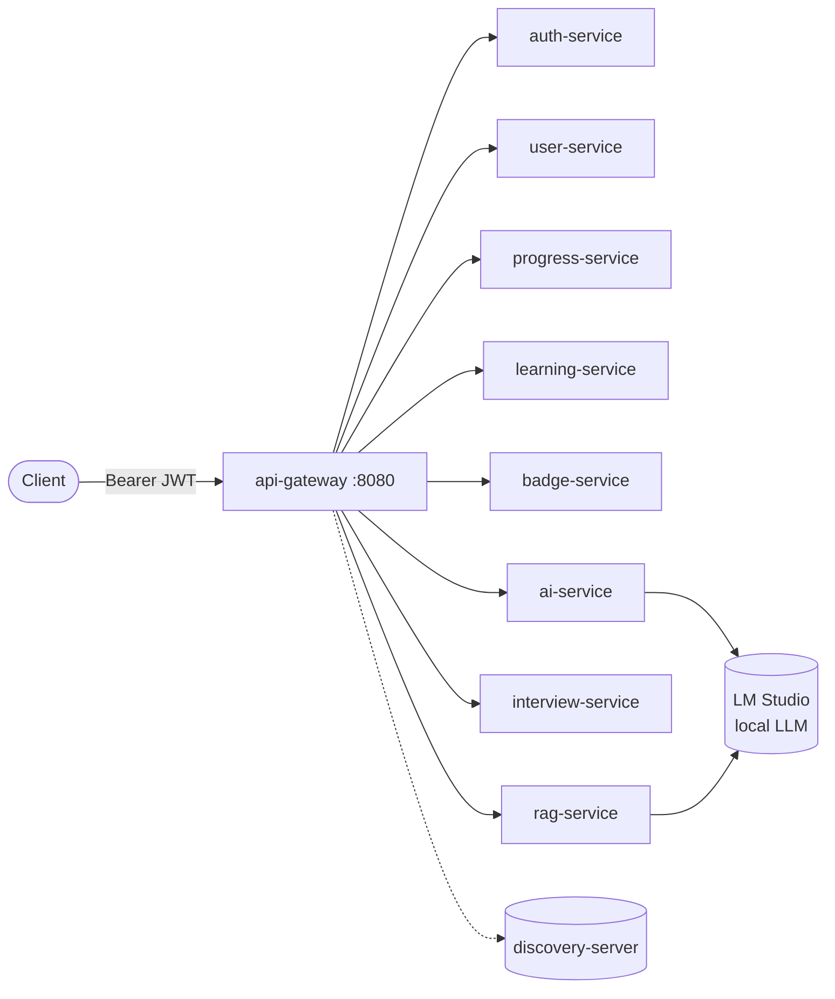

<div align="center">

# Athena Backend

**An AI Learning Operating System — the backend platform.**

[](https://github.com/Tamara556/Athena-Backend/actions/workflows/ci.yml)
[](LICENSE)
[](pom.xml)
[](pom.xml)

</div>

---

## Overview

**Athena** is an AI Learning Operating System: instead of a static course catalogue, it
builds a personalized, continuously adapting curriculum around one learner — an
AI-generated roadmap, a daily "mission" that adjusts itself based on how the day is
actually going, weekly interviews that measure real skill, a knowledge graph that tracks
mastery per topic, and a memory layer the learner can query for grounded answers about
their own progress.

This repository is the **backend platform**: 12 Spring Boot microservices, one Postgres
database per service, Kafka event choreography, Redis caching, Eureka service discovery,
and a local LLM (via [LM Studio](https://lmstudio.ai)) doing every piece of AI reasoning
— no external paid AI API. The companion Angular frontend lives in a
[separate repository](https://github.com/Tamara556/Athena-Frontend) (see
[`docs/Frontend.md`](docs/Frontend.md)).

**Who this is for:** engineers interested in a realistic, non-toy example of an
event-driven Spring Boot microservices system with a local-LLM AI layer wired all the
way through — onboarding, content generation, adaptive planning, evaluation, and
retrieval-augmented memory — built with clean service boundaries and no shared database.

**Project goals:** keep AI reasoning centralized and swappable (one integration point,
structured outputs, graceful degradation on LLM outages), keep services independently
deployable and boring to operate (DB-per-service, gateway-only auth, event
choreography over synchronous chains), and keep the whole thing honestly documented as
it grows — see [`docs/Architecture.md`](docs/Architecture.md) for an explicit strengths/
weaknesses review of the current design, not just a sales pitch.

---

## Features

| Category | What's implemented |
|---|---|
| **Authentication & Security** | Register/login/refresh (JWT), phone-based 2FA, device-session management, login-activity history, password/email change, self-service data export, S3-backed avatar upload |
| **AI Onboarding** | Event-driven onboarding triggered by registration; goal capture → adaptive assessment → domain/level analysis, generated by a local LLM |
| **Roadmap** | AI-generated learning roadmap (phases/nodes) from the onboarding analysis, with per-phase completion tracking |
| **Daily Journey** | A daily, block-by-block adaptive learning plan that reprioritizes itself from completion speed, quiz confidence, and check-ins — see [`docs/DAILY-JOURNEY.md`](docs/DAILY-JOURNEY.md) |
| **Learning Sessions** | Per-roadmap-node generated lesson content (readings, videos, practice, quizzes), kept a rolling 5-node lookahead ahead of the learner |
| **Knowledge Graph** | Per-skill mastery/confidence tracking, seeded from onboarding and updated from interview weaknesses and quiz results, with a visualization + history API |
| **Interviews** | Weekly AI-generated assessments, evaluated by the LLM, feeding weaknesses back into the Knowledge Graph |
| **RAG Memory** | Document ingestion → chunking → embeddings (pgvector) → grounded Q&A with citations, plus similarity search and "what's next" recommendations |
| **Progress & Streaks** | Task-completion metrics, daily streaks, rolling 7-day summaries, event-driven from learning activity |
| **Achievements / Badges** | Rule-based badge awards (streaks, task counts) and AI-suggested badges (validated before persisting) |
| **Microservices Platform** | Eureka discovery, gateway-centralized JWT auth, Kafka event backbone (~28 event types), Redis caching, database-per-service |

Full endpoint-level detail: [`docs/API.md`](docs/API.md) and
[`docs/Backend.md`](docs/Backend.md).

---

## Architecture



Each service owns its own PostgreSQL database; cross-service side effects flow through
Kafka rather than direct calls (registration → auto-onboarding, task completion →
progress → badges, interview evaluation → knowledge graph, and more). The full diagram
set — service graph, request flow, event flow — plus every design decision and an
explicit strengths/weaknesses review lives in **[`docs/Architecture.md`](docs/Architecture.md)**.

---

## Tech stack

| Concern | Choice |
|---|---|
| Language | Java 26 |
| Framework | Spring Boot 4.0.5 |
| Cloud | Spring Cloud 2025.1.1 (Oakwood) — Eureka, Gateway (WebFlux), OpenFeign |
| Persistence | Spring Data JPA / Hibernate, PostgreSQL 17 (+ pgvector for `rag-service`) |
| Migrations | Liquibase |
| Messaging | Apache Kafka (KRaft mode) |
| Caching | Redis |
| Auth | JWT (JJWT), BCrypt, phone-based 2FA (Twilio) |
| AI | Local LLM via LM Studio (OpenAI-compatible), structured/schema-enforced outputs |
| Object storage | S3-compatible (LocalStack locally) |
| Observability | Structured (ECS) logging, Micrometer + Brave tracing, optional CloudWatch shipping |
| Build | Maven (multi-module), Maven Wrapper |
| Tests | JUnit 5, Mockito, MockMvc, WebFlux `MockServerWebExchange` |
| Containerization | Docker, Docker Compose |
| Frontend (separate repo) | Angular 20, Signals |

---

## Folder structure

```
athena-backend-parent/
├── athena-common/      shared JWT, ApiError, exceptions, S3 storage, CloudWatch logging, Kafka events
├── athena-llm/          shared LLM provider abstraction (LM Studio)
├── discovery-server/    Eureka registry                              :8761
├── api-gateway/         routing + JWT filter                         :8080
├── auth-service/        accounts, JWT, 2FA, devices, export          :8081
├── user-service/        profiles + settings                          :8082
├── progress-service/    progress + streaks                           :8083
├── learning-service/    plans, tasks, sessions                       :8084
├── badge-service/       badge catalogue + awards                     :8085
├── ai-service/          LLM orchestration (onboarding→RAG's neighbor) :8086
├── interview-service/   weekly interviews                            :8087
├── rag-service/         memory, retrieval, recommendations            :8088
├── docs/                full documentation set (see below)
├── postman/             Postman collections
├── docker-compose.yml   full local stack
└── pom.xml               aggregator POM
```

Full annotated tree: [`docs/Project-Structure.md`](docs/Project-Structure.md).

---

## Getting started

### Prerequisites
- Docker + Docker Compose **(recommended — nothing else required)**, or JDK 26 + the
  bundled Maven Wrapper for a local run.
- [LM Studio](https://lmstudio.ai) running locally with a chat model (e.g. `qwen3-14b`)
  and an embedding model (`text-embedding-bge-m3`) loaded, for AI-backed features.

### Run everything
```bash
docker compose up --build
```
Brings up Eureka, Kafka, Redis, all 9 Postgres databases, and all 10 runnable services.
Wait ~60–90s for full registration, then:
```bash
curl -s -X POST http://localhost:8080/auth/register \
  -F email=ada@example.com -F password=Password123!
```
Tear down (and wipe data): `docker compose down -v`

### Run locally without Docker
```bash
./mvnw clean install
./mvnw -pl discovery-server spring-boot:run   # first
./mvnw -pl <service> spring-boot:run           # any/all of the rest
```

Full walkthrough, including running a single module against the rest of the Docker
stack: **[`docs/Development.md`](docs/Development.md)**.

---

## API

All endpoints go through the gateway, `http://localhost:8080`. There's no OpenAPI/Swagger
UI yet (tracked in [`ROADMAP.md`](ROADMAP.md)) — the contract is documented by hand in
**[`docs/API.md`](docs/API.md)** and **[`docs/Backend.md`](docs/Backend.md)**, with
runnable examples in the [`postman/`](postman) collections (historical snapshots — see
the caveat in `docs/API.md`).

---

## Contributing

Contributions are welcome. Start with **[`CONTRIBUTING.md`](CONTRIBUTING.md)** for the
fork/branch/PR process and coding conventions, and
**[`docs/Contributing.md`](docs/Contributing.md)** for the repo-specific build/test
mechanics. Please also read **[`CODE_OF_CONDUCT.md`](CODE_OF_CONDUCT.md)**.

---

## Development workflow

Fork → feature branch off `master` → commit in focused, descriptive commits → open a PR
against `master` → CI (`ci.yml`) builds and tests the full reactor → review → merge.
See `CONTRIBUTING.md` for the specifics (naming, commit style, review expectations).

---

## Roadmap

Tracked in **[`ROADMAP.md`](ROADMAP.md)** — Completed / In Progress / Planned, built only
from what's verifiably true of the codebase today (uncommitted work, documented
extension points, and explicitly recommended future work — never invented features).

---

## License

[MIT](LICENSE).

---

## Support

- **Bugs / feature requests**: open a [GitHub Issue](https://github.com/Tamara556/Athena-Backend/issues)
  using the provided templates.
- **Security vulnerabilities**: see **[`SECURITY.md`](SECURITY.md)** — please do not
  file a public issue for a suspected vulnerability.
- **Questions / design discussion**: GitHub Discussions is recommended but not yet
  enabled for this repository (see `docs/Contributing.md`) — use an Issue in the
  meantime.

---

## Acknowledgements

Built on Spring Boot, Spring Cloud, Apache Kafka, Redis, PostgreSQL, pgvector, and
[LM Studio](https://lmstudio.ai) for fully local LLM inference.
