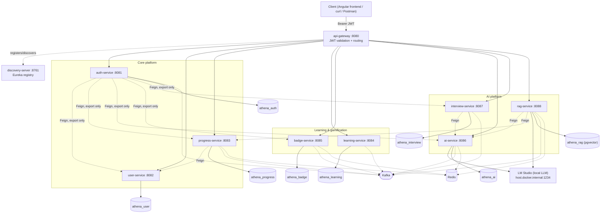
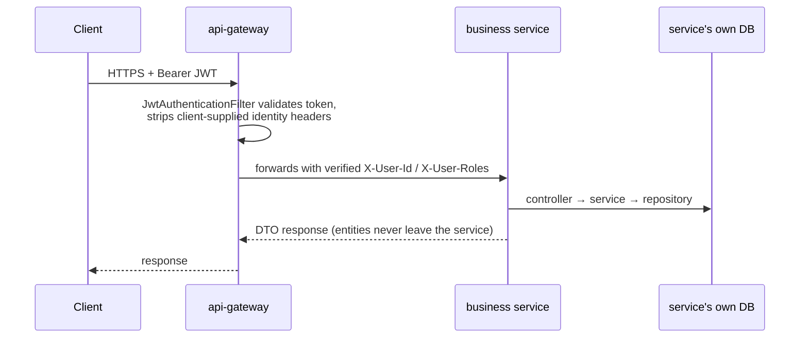
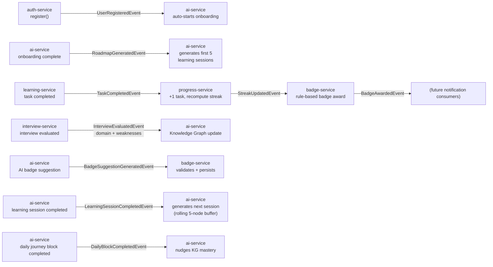

# Architecture

This is the consolidated, **current-state** architecture doc. It supersedes the
service-count and route summaries in `ARCHITECTURE-V2.md` / `ARCHITECTURE-V3.md` /
`DAILY-JOURNEY.md`, which remain in `docs/` as historical design records — they explain
*why* things were built the way they were and are still accurate for the sub-systems
they cover (event choreography rules, badge thresholds, the Daily Journey block
algorithm). This document is the map of the whole system as it stands today, including
`rag-service`, which predates none of them.

## 1. System overview

Athena Backend is 12 Spring Boot modules: 1 registry, 1 gateway, 2 shared libraries, and
8 business services, each with its own PostgreSQL database, coordinated through Eureka
service discovery, Kafka event choreography, Redis caching, and a local LM Studio model
for every AI capability.

## 2. Request flow

Every synchronous client request follows the same shape:

`auth-service` is the only exception: `/auth/**` is public at the gateway (registration
and login can't require a token yet), and `/actuator/**` is public for health checks.
Every other route requires a valid access token.

## 3. Event-driven flows

Kafka is the backbone for cross-service side effects — a service never calls another
service synchronously just to trigger a side effect; it publishes an event and lets the
interested service(s) react. `athena-common`'s `event` package is the shared schema
(record types) and `KafkaTopics` is the topic-name catalogue, so producers and consumers
never hand-roll topic strings.

Full event catalogue (types, topics, producers, consumers) is enumerated across
`docs/ARCHITECTURE-V2.md` §3, `docs/ARCHITECTURE-V3.md` §"New/changed events", and
`docs/DAILY-JOURNEY.md` §8 — collectively ~28 event types are defined in
`athena-common/event`.

## 4. Design decisions

- **Centralized auth at the edge.** Only `api-gateway` validates JWTs. On success it
  forwards verified identity as `X-User-Id`/`X-User-Roles` and strips any client-supplied
  copies first, so they can never be spoofed even if a request reaches a service
  directly. Downstream services trust these headers unconditionally and never
  re-validate the token — this only holds because services aren't meant to be reachable
  except through the gateway.
- **Database per service.** No service touches another's schema, ever. Nine independent
  Postgres instances (`rag-service`'s runs the `pgvector` extension for embeddings).
- **Event choreography over orchestration** for cross-service side effects (progress →
  badges, registration → onboarding, interview → knowledge graph). Keeps services
  decoupled — a consumer can be added or removed without the producer changing.
- **OpenFeign reserved for synchronous, read-like calls that must complete before
  responding** (e.g. "does this user exist" from `progress-service`, "generate these
  interview questions now" from `interview-service`, `auth-service`'s data-export
  fan-out). Everything else is async.
- **ai-service owns all LLM interaction.** No other service talks to LM Studio directly
  — `interview-service` and `rag-service`'s consumers reach it only through `ai-service`
  or their own `athena-llm` client for embeddings (`rag-service` does call LM Studio
  directly for embeddings, since that's infrastructure, not reasoning — see
  `docs/Backend.md`). This keeps prompt-construction and JSON-schema enforcement in one
  place.
- **Structured LLM outputs, never persisted prompts.** Every generation call enforces a
  JSON schema against LM Studio's response; `ai_requests`/`ai_responses` store only
  metadata (model, latency, token counts) — prompt and completion text are never
  written to disk.
- **Shared libraries, not a shared service.** `athena-common` (JWT, `ApiError`,
  exceptions, image storage, CloudWatch logging, event schemas) and `athena-llm` (LLM
  provider abstraction) are Maven dependencies, not network calls — cross-cutting code
  is reused without adding a runtime dependency between services.
- **RAG as its own service, not folded into ai-service.** `rag-service` has a distinct
  operational profile (pgvector, embedding-heavy, chunking/ingestion pipelines) and a
  distinct scaling shape from the rest of `ai-service`'s orchestration logic — kept
  separate rather than growing an already-large module further.

## 5. Architecture review

### Strengths
- Clean, consistent layering (`controller → service → repository`, DTOs at every
  boundary, entities never cross a service boundary) across all 12 modules.
- Database-per-service is followed without exception — no shared schema shortcuts.
- Gateway-centralized auth is simple to reason about and consistently applied (verified
  directly in `JwtAuthenticationFilter` — only `/auth/**` and `/actuator/**` are public).
- Event choreography keeps `progress-service`, `badge-service`, and the Knowledge Graph
  decoupled from the services that trigger them; new consumers can be added without
  touching producers.
- Shared libraries (`athena-common`, `athena-llm`) avoid both code duplication and a
  premature "common service" network dependency.
- AI failure handling is deliberately non-destructive: `503` + persisted retry state
  instead of data loss or bare `500`s on an LM Studio outage.

### Weaknesses / risks
- **`ai-service` is doing a lot.** Onboarding, roadmap, daily plan, Daily Journey,
  learning sessions, Knowledge Graph, AI interview generation/evaluation, and AI badge
  suggestions all live in one module and one database. It's internally well-organized
  by feature package, but it's the one module where a service-boundary refactor would
  have the highest payoff if the system keeps growing (a split-by-bounded-context plan
  exists as a design document, not yet implemented — see the note at the end of this
  section).
- **No OpenAPI/springdoc anywhere.** The API contract is hand-maintained documentation
  plus drifting Postman collections; there's no machine-checked or auto-generated
  contract, and no live `/swagger-ui`.
- **No centralized configuration server.** Each service's `application.yml` plus
  environment variables is the whole configuration story — fine at this scale, but there
  is no Spring Cloud Config / Vault-backed secret management, and JWT secrets/DB
  credentials are plain environment variables (acceptable for local dev, a gap for a
  real deployment — see `docs/Security.md` and `docs/Deployment.md`).
- **Postman collections are stale.** Three versioned snapshots (V1/V2/V3) exist but none
  reflect `rag-service`, the Daily Journey endpoints, or several `auth-service` routes
  added since V3 (2FA, devices, export).
- **No CI image publishing or deployment pipeline.** `ci.yml` builds and tests on every
  push/PR; there's no step that builds/publishes Docker images or deploys anywhere.

### Scalability & maintainability notes
- Each service can be scaled independently behind Eureka/the gateway's load-balanced
  URIs; nothing in the design assumes a single instance except the Kafka/Redis/Eureka
  infrastructure containers themselves, none of which are clustered in
  `docker-compose.yml` (expected — that file is a local dev stack, not a production
  topology).
- Redis caching (progress, badges, learning sessions, Knowledge Graph visualization,
  Daily Journey) is applied consistently with explicit eviction on mutation, which keeps
  cache-staleness bugs low but means every write path has to remember to evict — worth
  automated test coverage per cache as the system grows.
- A **DDD-oriented service-boundary migration plan** for `ai-service` exists as prior
  analysis (referenced in project memory as
  `athena-backend-ddd-migration-plan`) but has not been implemented; it is not part of
  this repository and is mentioned here only as a pointer for future architectural work,
  not as a description of current code.
